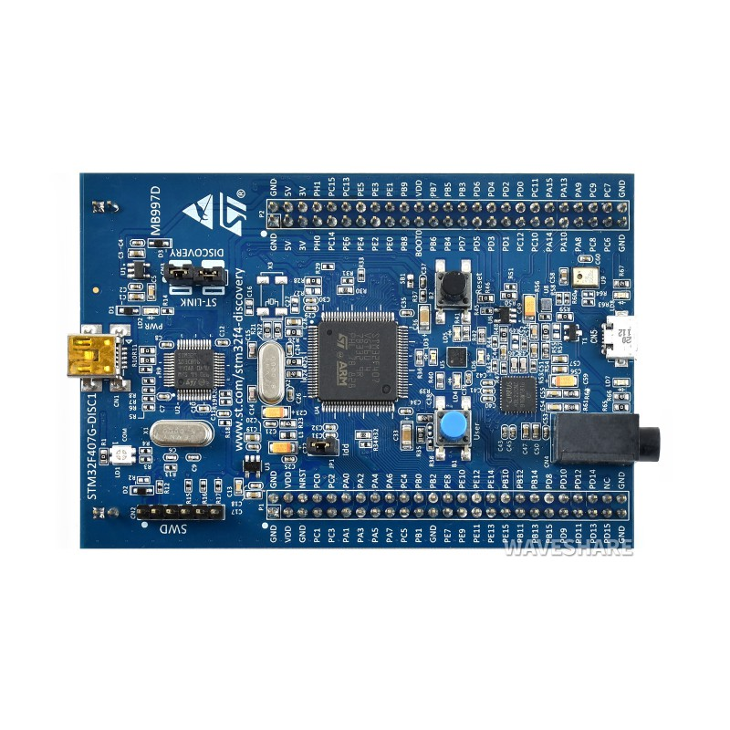
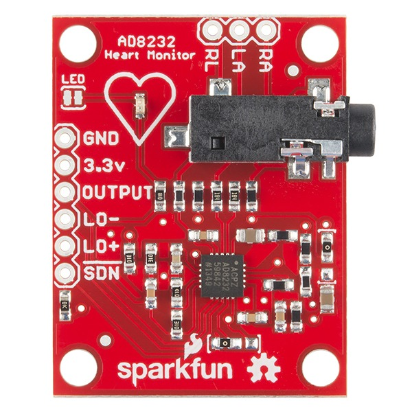
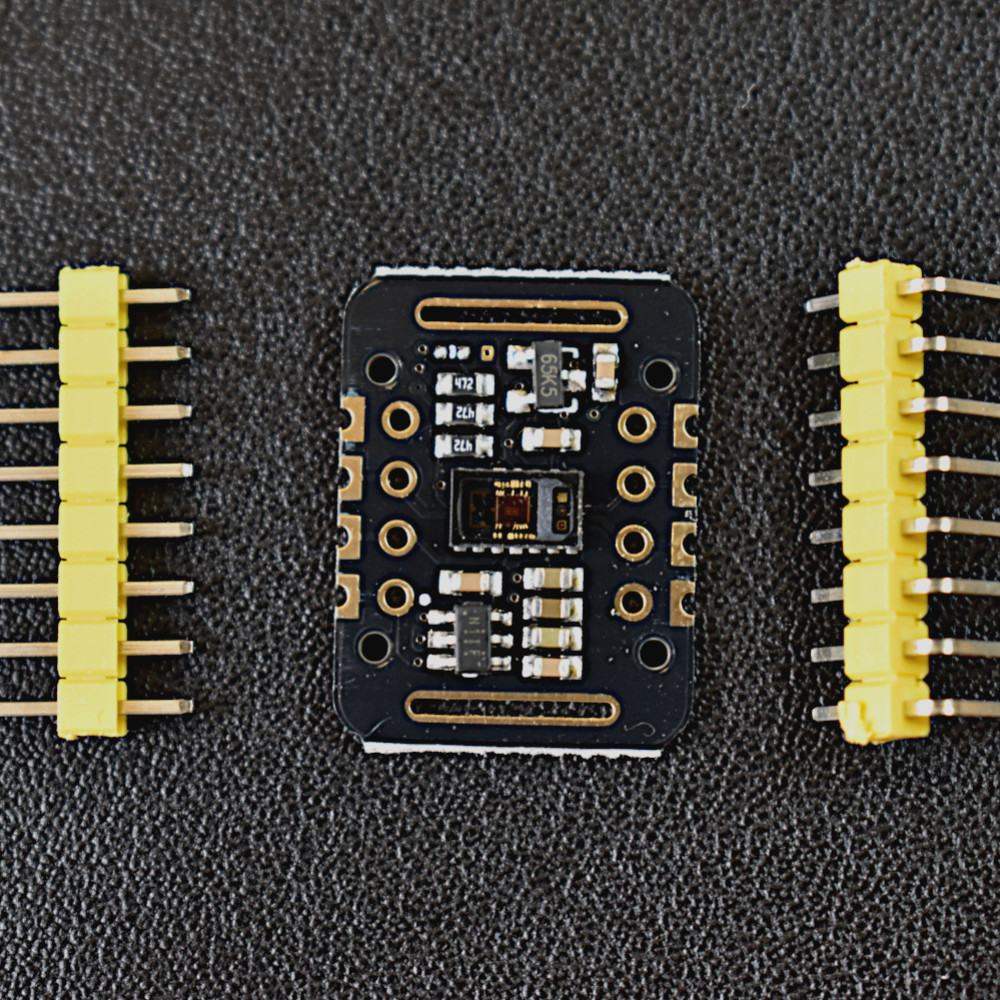
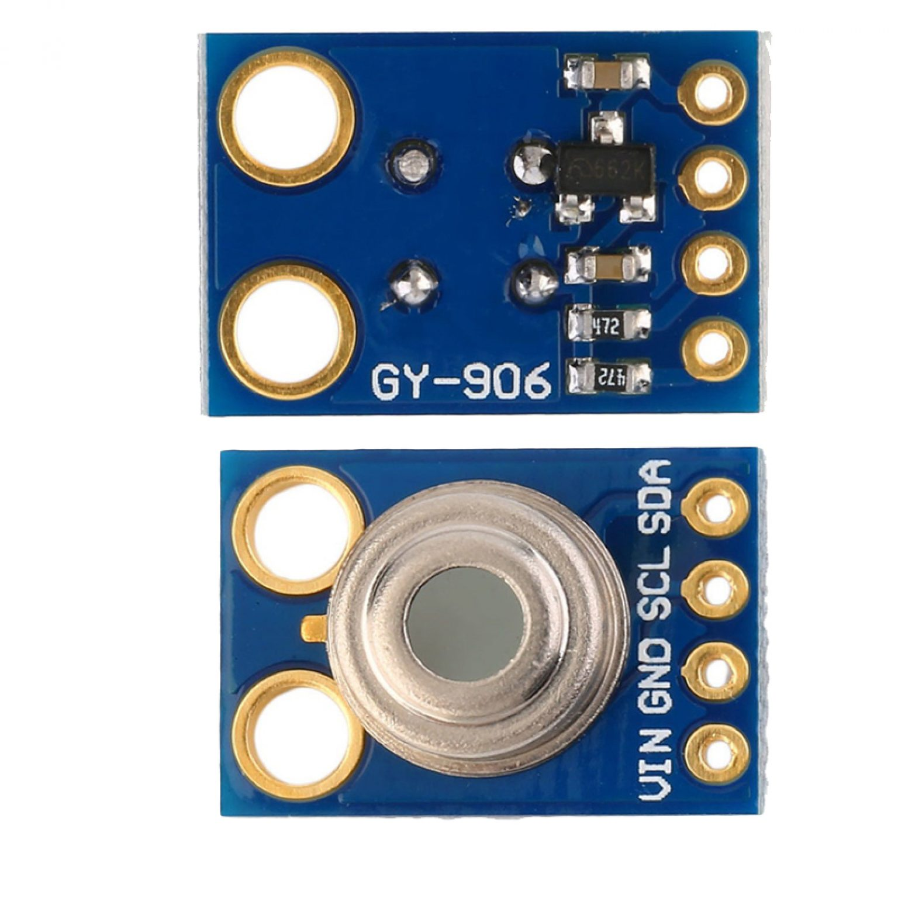
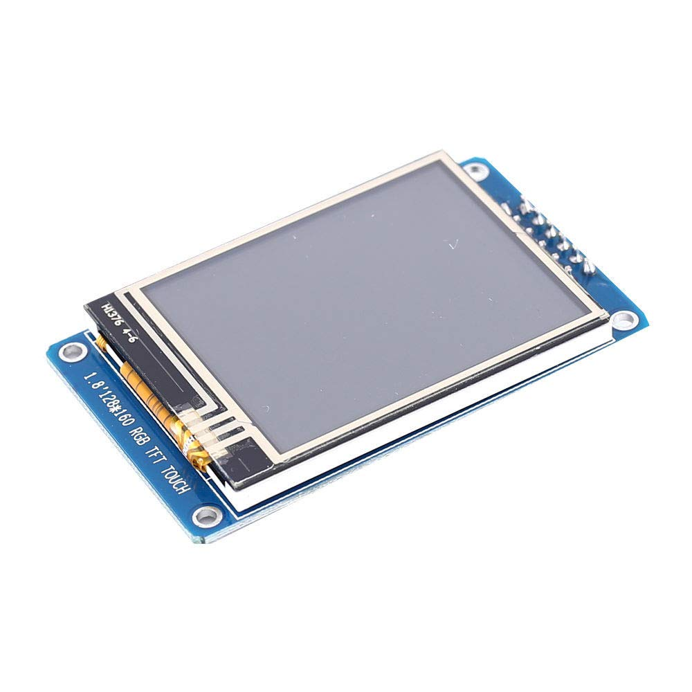
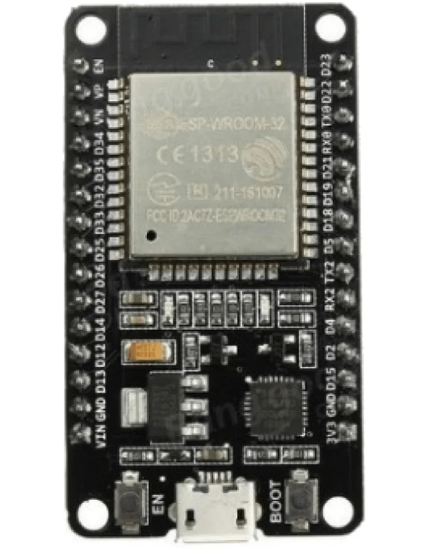
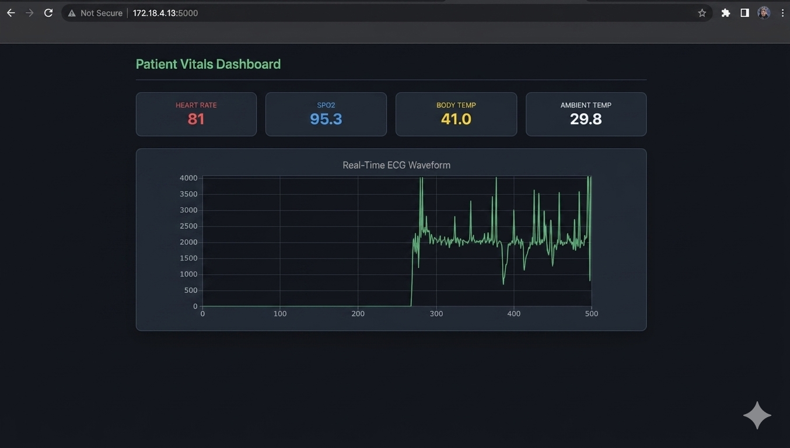
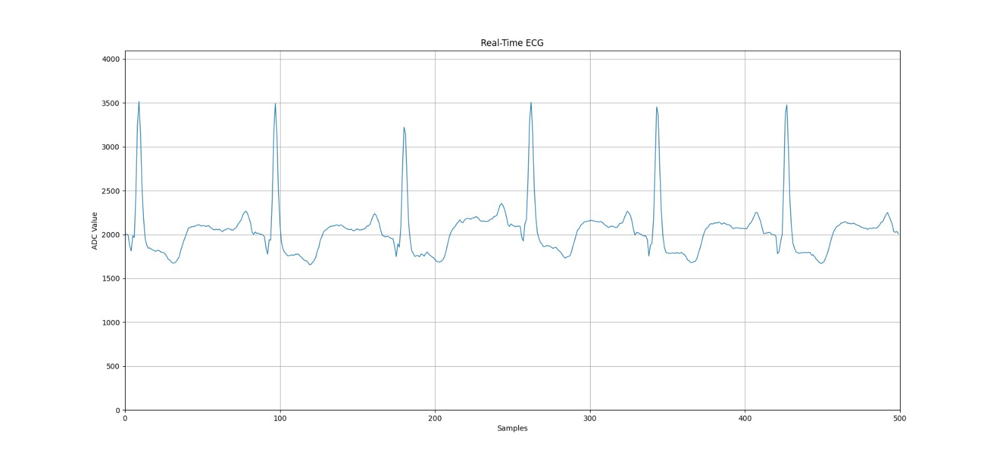
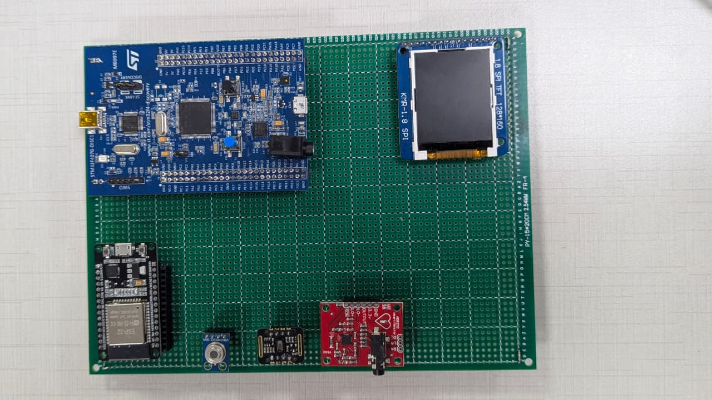
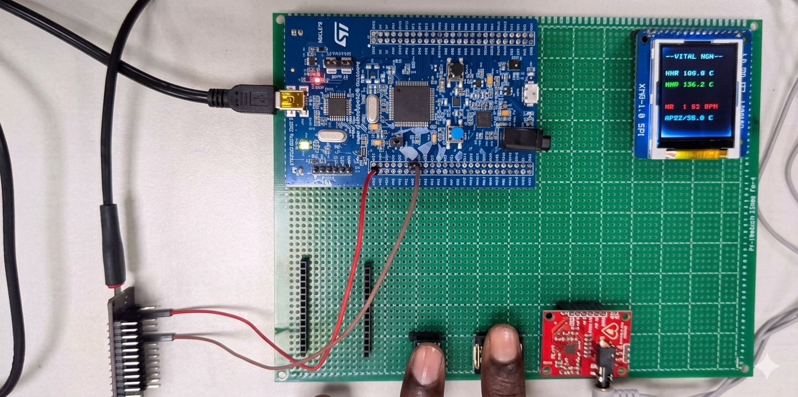

# RTOS-Based Patient Health Monitoring System

## 📌 Project Overview

The **RTOS-Based Patient Health Monitoring System** is a real-time embedded healthcare monitoring project developed using **STM32F407**, **FreeRTOS**, multiple health sensors, and **ESP32-based IoT connectivity**.

The system monitors important patient parameters such as:

- ECG
- Heart Rate
- SpO₂
- Body Temperature
- Ambient Temperature

The collected data is displayed locally on an **ST7735 TFT display** and transmitted through **ESP32 and Wi-Fi** to a **Flask web application** using HTTP for remote monitoring.

---

## 🎯 Objectives

- Monitor multiple patient health parameters in real time.
- Acquire sensor data using STM32F407.
- Use FreeRTOS for concurrent task execution.
- Interface multiple sensors with the microcontroller.
- Display health information on an ST7735 TFT display.
- Transfer data from STM32 to ESP32 through UART.
- Send health data over Wi-Fi using HTTP.
- Display patient information on a web dashboard.
- Demonstrate real-time embedded system concepts.

---

## 🏗️ System Architecture

    Patient
       │
       ├── AD8232 ─────── ECG
       │
       ├── MAX30102 ───── Heart Rate / SpO₂
       │
       └── MLX90614 ───── Temperature
                 │
                 ▼
          ┌───────────────┐
          │   STM32F407   │
          │               │
          │   FreeRTOS    │
          │               │
          │ Data Acquire  │
          │ Processing    │
          │ Communication │
          └───────┬───────┘
                  │
                 UART
                  │
                  ▼
          ┌───────────────┐
          │     ESP32     │
          │     Wi-Fi     │
          └───────┬───────┘
                  │
                 HTTP
                  │
                  ▼
          ┌───────────────┐
          │ Flask Backend │
          └───────┬───────┘
                  │
                  ▼
          ┌───────────────┐
          │ Web Dashboard │
          └───────────────┘

---

## 🔧 Hardware Components

| Component | Purpose |
|---|---|
| STM32F407 Discovery | Main microcontroller |
| AD8232 | ECG signal acquisition |
| MAX30102 | Heart Rate and SpO₂ measurement |
| MLX90614 | Temperature measurement |
| ST7735 TFT | Local data display |
| ESP32 | Wi-Fi and IoT communication |
| Buzzer | Alert indication |

---

## 🧩 Hardware Details

### 1. STM32F407 Discovery Board

The STM32F407 Discovery board acts as the main processing controller of the system.

It is responsible for:

- Sensor interfacing
- Data acquisition
- Data processing
- FreeRTOS task execution
- UART communication
- TFT display control
- Communication with ESP32

---

### 2. AD8232 ECG Sensor

The AD8232 is used to acquire the ECG signal from the patient.

The ECG signal is provided as an analog signal to the STM32 ADC.

ECG acquisition flow:

    ECG Signal
         ↓
        ADC
         ↓
        DMA
         ↓
    ADC Buffer
         ↓
     Processing
         ↓
    ECG Waveform

---

### 3. MAX30102 Sensor

The MAX30102 sensor is used to measure:

- Heart Rate
- SpO₂

The sensor provides optical sensing data to the STM32 for processing.

---

### 4. MLX90614 Temperature Sensor

The MLX90614 is a non-contact infrared temperature sensor used for temperature measurement.

---

### 5. ST7735 TFT Display

The ST7735 TFT display is used to provide a local interface for displaying patient monitoring information.

---

### 6. ESP32

The ESP32 provides Wi-Fi connectivity for the IoT part of the system.

The STM32 sends processed health data to the ESP32 through UART.

The ESP32 then sends the data over Wi-Fi to the Flask backend using HTTP.

---

## ⚙️ ECG Signal Acquisition

The ECG signal from the AD8232 is acquired using the ADC of the STM32F407.

The ADC is configured for:

- 12-bit resolution
- ADC1
- Single-channel conversion
- Timer-triggered conversion
- DMA-based data transfer

### ADC + Timer + DMA

    TIM2 Trigger
         ↓
    ADC Conversion
         ↓
    DMA Transfer
         ↓
    ADC Buffer
         ↓
    ECG Processing

DMA allows ADC data to be transferred to memory with less CPU involvement.

---

## ⏱️ FreeRTOS

**FreeRTOS** is used to manage multiple operations concurrently.

The system includes real-time operations related to:

- Sensor acquisition
- Data processing
- Display update
- Communication
- IoT data transmission

FreeRTOS provides structured task management and helps the system handle multiple operations efficiently.

---

## 🔄 System Data Flow

    Sensors
       ↓
    STM32F407
       ↓
    FreeRTOS
       ↓
    Data Processing
       ↓
    ST7735 TFT Display
       ↓
    UART
       ↓
    ESP32
       ↓
    Wi-Fi
       ↓
    HTTP
       ↓
    Flask Backend
       ↓
    Web Dashboard

---

## 📡 IoT Communication

The STM32 communicates with the ESP32 through **UART**.

The ESP32 connects to Wi-Fi and sends the received health data to the Flask backend using **HTTP**.

    STM32
      │
     UART
      ↓
    ESP32
      │
     Wi-Fi
      ↓
     HTTP
      ↓
    Flask Server
      ↓
    Web Dashboard

---

## 🖥️ Web Dashboard

The Flask-based web dashboard displays the received patient monitoring information.

The dashboard displays parameters such as:

- Heart Rate
- SpO₂
- Body Temperature
- Ambient Temperature
- ECG waveform

---

## 📈 ECG Waveform

The acquired ECG samples can be visualized as an ECG waveform.

---

## 🔌 Complete Hardware Setup

The complete hardware setup integrates the STM32F407, sensors, TFT display, ESP32, and supporting connections.

---

## 🧪 Final Working System

The final system demonstrates sensor acquisition, real-time processing, local display, and IoT communication.

---

## 💻 Software and Technologies

- Embedded C
- STM32F407
- FreeRTOS
- STM32CubeIDE
- STM32 HAL
- ADC
- DMA
- Timers
- UART
- I2C
- SPI
- GPIO
- ESP32
- Wi-Fi
- HTTP
- Flask
- Web Dashboard
- Git / GitHub

---

## 🔩 STM32 Peripherals Used

| Peripheral | Application |
|---|---|
| ADC | ECG signal acquisition |
| DMA | Efficient ADC data transfer |
| TIM2 | ADC trigger generation |
| UART | STM32 to ESP32 communication |
| I2C | Sensor communication |
| GPIO | Digital control and alerts |
| TFT Interface | Local display |

---

## 📊 Project Results

The system demonstrates:

- Real-time ECG acquisition
- Heart Rate monitoring
- SpO₂ monitoring
- Temperature monitoring
- Local TFT display
- UART communication
- ESP32 Wi-Fi connectivity
- HTTP-based data transmission
- Flask web dashboard
- Real-time task management using FreeRTOS

---

## 📁 Repository Structure

    RTOS-Based-Patient-Monitoring-System/
    │
    ├── RTOS_ver1/
    │   ├── Core/
    │   ├── Drivers/
    │   ├── Middlewares/
    │   ├── Debug/
    │   ├── RTOS_ver1.ioc
    │   └── ...
    │
    ├── Images/
    │   ├── complete_hardware.jpg
    │   ├── stm32f407.jpg
    │   ├── ad8232.jpg
    │   ├── max30102.jpg
    │   ├── mlx90614.jpg
    │   ├── st7735_tft.jpg
    │   ├── esp32.jpg
    │   ├── ecg_waveform.jpg
    │   ├── dashboard.jpg
    │   └── final_system.jpg
    │
    └── README.md

---
## 👥 Team Members

This project was developed as a group project by the following team members:

| Team Member | Contribution | Sensor / Component |
|---|---|---|
| **Dussa Sainath Ramulu** | Display Interfacing | **ST7735 TFT Display** |
| **Chittimalla Karthik** | ECG Signal Acquisition | **AD8232 ECG Sensor** |
| **Bablu Pawar** | SpO₂ Monitoring | **MAX30102 Sensor** |
| **Bora Sairaj Kumar** | Temperature Monitoring | **MLX90614 Temperature Sensor** |

### Team Contributions

- **Dussa Sainath Ramulu** – Worked on **ST7735 TFT Display interfacing** and displaying the monitored health parameters.
- **Chittimalla Karthik** – Worked on **ECG signal acquisition** using the **AD8232 ECG sensor** and STM32 ADC.
- **Bablu Pawar** – Worked on **SpO₂ monitoring** using the **MAX30102 sensor**.
- **Bora Sairaj Kumar** – Worked on **temperature monitoring** using the **MLX90614 temperature sensor**.
---

## 📸 Project Images

### Complete Hardware Setup

### STM32F407 Discovery Board

### AD8232 ECG Sensor

### MAX30102 Sensor

### MLX90614 Temperature Sensor

### ST7735 TFT Display

### ESP32

### ECG Waveform

### Web Dashboard

### Final Working System

---

## 📌 Conclusion

The **RTOS-Based Patient Health Monitoring System** demonstrates the integration of embedded systems, real-time operating systems, sensor interfacing, communication protocols, and IoT technologies.

The combination of **STM32F407, FreeRTOS, multiple health sensors, ESP32, HTTP, and Flask** provides a complete real-time patient monitoring solution.

---

## ⭐ Technologies

**STM32F407 | FreeRTOS | Embedded C | ADC | DMA | I2C | SPI| ESP32 | Wi-Fi | HTTP | Flask | IoT**
